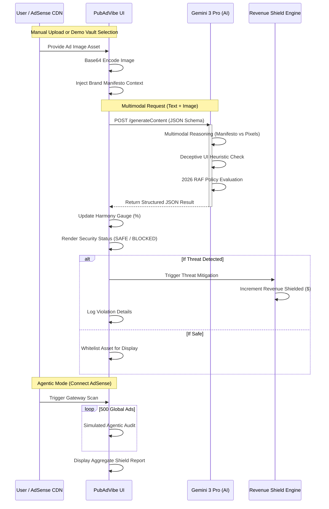

# PubAdVibe | AI Architecture

PubAdVibe is a high-end security command center built to restore trust in digital advertising. It leverages cutting-edge Generative AI to perform real-time, multimodal audits of creative assets for **MyMorningYoga.net**.

## 1. Process Sequence Diagram

The following diagram illustrates the lifecycle of an ad audit within the PubAdVibe ecosystem, from ingestion to remediation.



## 2. AI Model Interaction: Gemini 3 Pro
The application is powered exclusively by the **Gemini 3 Pro Preview** (`gemini-3-pro-preview`) model via the `@google/genai` SDK.

### The Multimodal Pipeline
PubAdVibe utilizes a **Late-Binding Multimodal Ingestion** strategy:

1.  **Pixel Ingestion**: Creative assets (JPG/PNG) are converted to `base64` and passed as `inlineData` parts. This allows the model to see the ad exactly as a user would.
2.  **Contextual Guardrails**: The `BRAND_MANIFESTO` for **MyMorningYoga.net** is injected into the prompt. This forces the model to move beyond generic safety and into "Brand Safety," identifying if "Neon colors" or "Medical gore" clash with the site's organic vibe.
3.  **Strict Schema Enforcement**: We utilize the `responseSchema` configuration. This is critical for the UI to parse scores and finding arrays without hallucination or formatting errors.

### Interaction Payload Example
```typescript
const response = await ai.models.generateContent({
  model: 'gemini-3-pro-preview',
  contents: [{ 
    parts: [
      { text: "Evaluate against MyMorningYoga aesthetic rules..." }, 
      { inlineData: { data: "...", mimeType: "image/png" } }
    ] 
  }],
  config: { 
    responseMimeType: "application/json", 
    responseSchema: {
      type: Type.OBJECT,
      properties: {
        harmonyScore: { type: Type.NUMBER },
        deceptiveUIScan: { type: Type.OBJECT, ... },
        summary: { type: Type.STRING }
      }
    } 
  }
});
```

## 3. AdSense Gateway Simulation
The "Connect to AdSense" feature represents the **PubAdVibe Agentic Protocol (PAP)**. 

### The Simulated Gateway Logic:
- **CDN Interception**: The "Agent" simulates an iterative loop through a simulated AdSense queue. 
- **Policy Enforcement Layer**: In a production environment, this agent would intercept the AdSense `adsbygoogle.js` response, check the ad creative ID against the PubAdVibe compliance cache, and serve a "Transparency Placeholder" if the ad fails the Gemini scan.
- **Automated Remediation**: The "Shield Report" summarizes the agent's work, showing how many "Deepfake Scams" were automatically purged before reaching the end-user's browser.

## 4. Security Heuristics
PubAdVibe leverages Gemini's visual reasoning for complex threats:
- **Fake Interaction Detection**: The AI identifies button placements (like "X" icons) that are part of the image bit-map rather than legitimate DOM elements.
- **RAF 2026 Compliance**: The model checks for "celebrity-clone" endorsements—AI-generated figures used to sell fraudulent wellness products, which is a major violation of upcoming 2026 internet safety regulations.

## 5. System Decision Matrix 
- **BLOCK**: `harmonyScore < 50` OR `deceptiveUIScan.status === 'THREAT_DETECTED'`.
- **WARN**: `harmonyScore` between 50 and 70 (Aesthetic mismatch).
- **ALLOW**: `harmonyScore > 70` AND `deceptiveUIScan.status === 'CLEAN'`.
